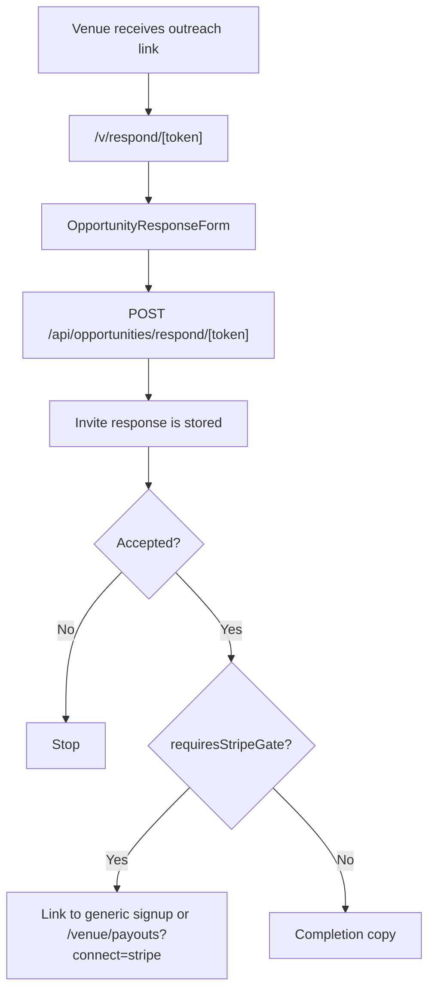
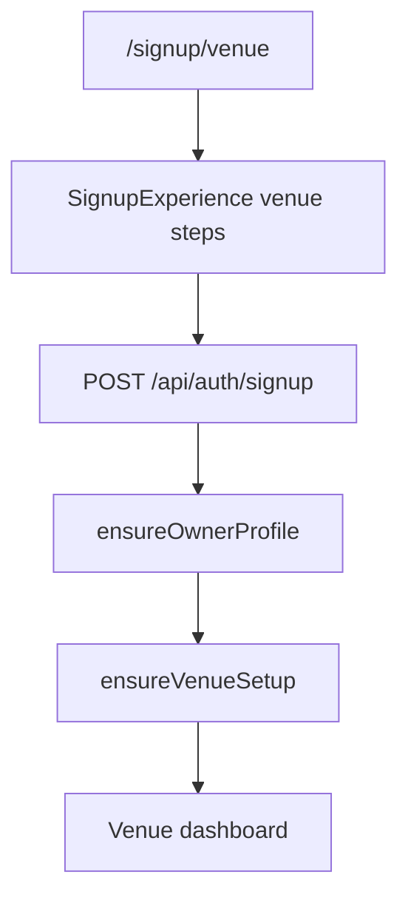
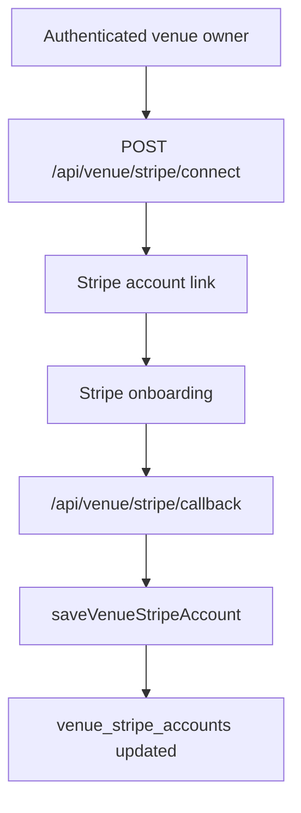

# Venue Claim + Onboarding Flow Audit

Phase 1 audit for the venue claim, Stripe onboarding, and post-signup profile-completion path. This document is intentionally read-only: it records the current repo state, scenario gaps, and recommended Phase 2 implementation buckets.

## 1. Sources Inspected

### Product and route constraints

- `AGENTS.md`: product is 3rdPlace, the agent proposes and the host approves, and partner dashboards under `app/(dashboard)/` are legacy and must not receive new routes. New work should live under `(planner)/`, `admin/`, or existing legacy files only.

### Opportunity response and token lookup

- `lib/opportunities/tokenValidate.ts:56`: `VENUE_SELECT` loads only `id`, `venue_name`, `name`, `venue_type`, `type`, `address`, `city`, `state`, `neighborhood`, and `standing_capacity`.
- `lib/opportunities/tokenValidate.ts:108`: `getOpportunityResponseContext` checks venue opportunity tokens first, then vendor opportunity tokens.
- `lib/opportunities/tokenValidate.ts:143`: `submitOpportunityResponse` updates the venue or vendor invite response payload and status.
- `lib/opportunities/tokenValidate.ts:209`: `getVenueResponseContext` loads venue invite, brief, and venue rows by `magic_link_token`.
- `app/v/respond/[token]/page.tsx:18`: public token page loads opportunity context and renders the response form.
- `components/opportunities/OpportunityResponseForm.tsx:50`: response form posts accept/reject/conditional response to `/api/opportunities/respond/${token}`.
- `components/opportunities/OpportunityResponseForm.tsx:79`: after accept, the form enters a `stripe_gate` step when `requiresStripeGate(...)` returns true.
- `components/opportunities/OpportunityResponseForm.tsx:247`: partner account creation links go to generic signup routes, not token-specific claim routes.
- `components/opportunities/OpportunityResponseForm.tsx:343`: Stripe gate copy links accepted partners to `/venue/payouts?connect=stripe&from_opportunity=...` or the vendor equivalent.
- `components/opportunities/OpportunityResponseForm.tsx:443`: `requiresStripeGate` uses `opportunity.partner?.stripe_account_id`, but the venue token query does not select `stripe_account_id`.
- `app/api/opportunities/respond/[token]/route.ts:49`: response API persists the opportunity response with service-role access and returns the updated status.

### Venue Stripe onboarding and account status

- `app/api/venue/stripe/connect/route.ts:18`: creates or reuses a venue Stripe Express account for the authenticated venue owner.
- `app/api/venue/stripe/connect/route.ts:67`: account-link return URL points to `/api/venue/stripe/callback`.
- `app/api/venue/stripe/callback/route.ts:24`: callback reads the authenticated owner and refreshes the Stripe account status.
- `app/api/venue/stripe/callback/route.ts:83`: callback can create a fresh account-link when Stripe sends a refresh request.
- `app/api/venue/stripe/status/route.ts:17`: status route returns stored and live Stripe Connect readiness for the venue owner.
- `app/api/venue/stripe/refresh/route.ts:17`: refresh route refreshes existing account state but does not generate a new onboarding link.
- `app/api/venue/stripe/dashboard/route.ts:12`: dashboard route creates a Stripe Express dashboard login link.
- `lib/stripe/connect.ts:95`: Stripe status mapping derives `account_status`, `charges_enabled`, `payouts_enabled`, `details_submitted`, and disabled reason.
- `lib/stripe/connect.ts:264`: `saveVenueStripeAccount` upserts `venue_stripe_accounts` and mirrors account state to `owner_profiles`.
- `lib/billing/stripeConnectGuard.ts:172`: shared Connect guard validates account id format, mode, charges, payouts, and disabled state.

### Venue claim and signup surfaces

- `app/(dashboard)/venue/claim-pending/page.tsx:8`: current claim-pending page is static copy with no token resume, claim status, or Stripe status logic.
- `app/auth/callback/route.ts:92`: OAuth callback blocks venue and vendor signup through Google and redirects to role-specific signup.
- `components/auth/SignupExperience.tsx:1091`: venue signup posts to `/api/auth/signup`; it does not pass or preserve an opportunity token.
- `app/api/auth/signup/route.ts:204`: venue signup validates the stable venue signup fields.
- `app/api/auth/signup/route.ts:355`: signup calls `ensureOwnerProfile`.
- `app/api/auth/signup/route.ts:397`: signup calls `ensureVenueSetup`.
- `lib/server/account-setup.ts:263`: `ensureVenueSetup` creates or updates a venue row by `owner_id`.
- `lib/server/account-setup.ts:499`: admin-seeded unclaimed venues are routed to `/venue/claim-pending`.

### Vendor claim comparator

- `app/vendor/claim/page.tsx:8`: vendor claim page reads an invite token and renders the claim flow.
- `app/api/vendor/claim/route.ts:11`: vendor claim API validates token and creates the vendor account.
- `lib/vendors/vendorClaims.ts:65`: vendor claim token details are loaded from invitation data.
- `lib/vendors/vendorClaims.ts:164`: vendor claim creates an auth user, internal user row, and updates `vendor_profiles` claim fields.
- `lib/vendors/vendorClaims.ts:252`: vendor rate agreement handling is wired into the claim flow.
- `components/vendor/VendorClaimFlow.tsx:57`: vendor claim flow creates account and logs the vendor in.
- `components/vendor/VendorClaimFlow.tsx:106`: vendor claim supports skip/start Stripe onboarding.
- `components/vendor/VendorClaimFlow.tsx:253`: vendor public catalog rate is optional, allowing private vendors to remain unpublished.

### Venue profile and dashboard data model

- `lib/types/database-generated.ts:8986`: `venue_stripe_accounts` has `charges_enabled`, `payouts_enabled`, `details_submitted`, `disabled_reason`, `last_synced_at`, and `account_status`.
- `lib/types/database-generated.ts:9042`: `venues` includes canonical profile fields including address, capacity, pricing, availability, amenities, photos, claim/publish fields, and Stripe mirror columns.
- `lib/types/database-generated.ts:8857`: `venue_photos` already exists as a normalized photo table.
- `lib/types/database-generated.ts:8892`: `venue_requirements` and `venue_rules` already exist as normalized venue policy tables.
- `app/(dashboard)/venue/listing/page.tsx:37`: existing venue listing page schema covers profile basics and photos.
- `app/(dashboard)/venue/listing/page.tsx:301`: existing listing form edits profile and photo data.
- `app/(dashboard)/venue/pricing/page.tsx:21`: existing pricing schema covers base price, deposit, cancellation, and bar/package economics.
- `app/(dashboard)/venue/pricing/page.tsx:157`: pricing page persists venue pricing updates.
- `app/(dashboard)/venue/payouts/page.tsx:609`: venue payouts page already renders Stripe Connect status and onboarding actions.
- `lib/venues/venue-adapter.ts:6`: existing venue adapter selects and normalizes a broad venue profile shape.
- `lib/venues/venue-adapter.ts:198`: existing venue adapter maps editable fields back to the database.

### Payment readiness and builder-facing fallback

- `app/api/planner/plans/[planId]/venue-payment/checkout/route.ts:145`: checkout requires a confirmed venue booking before payment.
- `app/api/planner/plans/[planId]/venue-payment/checkout/route.ts:180`: checkout loads venue owner and venue Stripe account before creating checkout.
- `app/api/planner/plans/[planId]/venue-payment/checkout/route.ts:306`: account lookup selects `stripe_account_id`, `account_status`, and `payouts_enabled`.
- `app/api/planner/plans/[planId]/venue-payment/checkout/route.ts:328`: checkout blocks missing or not-ready Connect accounts and returns concierge fallback.
- `app/api/planner/plans/[planId]/venue-payment/checkout/route.ts:417`: venue payment transaction is inserted only after readiness checks.
- `app/api/planner/plans/[planId]/venue-payment/checkout/route.ts:623`: checkout returns `concierge_required: true` for venue account readiness failures.
- `components/planner/VenueRentalPaymentButton.tsx:159`: builder UI maps concierge-required failures to a contact-the-team message.
- `components/planner/BookedPartnersWorkspace.tsx:653`: booked venue workspace renders the payment CTA when a rental transaction is ready.

## 2. Dependency Check

All required source surfaces from the Phase 1 prompt exist on `origin/main`:

| Required surface | Present | Notes |
| --- | --- | --- |
| `app/(dashboard)/venue/claim-pending/page.tsx` | Yes | Static placeholder only |
| `app/api/venue/stripe/connect/route.ts` | Yes | Authenticated owner onboarding start |
| `app/api/venue/stripe/callback/route.ts` | Yes | Stripe return and refresh handling |
| `app/api/venue/stripe/status/route.ts` | Yes | Status and readiness |
| `app/api/venue/stripe/refresh/route.ts` | Yes | Refresh existing status only |
| `app/api/venue/stripe/dashboard/route.ts` | Yes | Express dashboard login link |
| `lib/opportunities/tokenValidate.ts` | Yes | Venue response context is missing owner/claim/Stripe fields |
| `venue_stripe_accounts` | Yes | Generated types and migration present |
| `venues` table shape | Yes | Generated types present |
| `app/vendor/claim/page.tsx` | Yes | Working comparator flow |
| `lib/vendors/vendorClaims.ts` | Yes | Working comparator service |
| Venue rental checkout route | Yes | Concierge fallback present |
| `lib/billing/stripeConnectGuard.ts` | Yes | Shared Connect readiness helper |

## 3. Executive Summary

The venue claim and onboarding story is not broken at the database level, but it is incomplete as a product flow.

The repo has the ingredients:

- Public venue outreach tokens.
- Venue opportunity response persistence.
- Venue signup.
- Venue Stripe Connect onboarding routes.
- Venue listing/pricing dashboard pages.
- Venue rental payment readiness fallback.

But the actual "venue accepts outreach, claims the profile, finishes Stripe, and becomes payable" path is currently stitched together by generic signup and dashboard links. There is no dedicated venue claim flow equivalent to the vendor claim flow, and the public opportunity response form decides Stripe gating from `partner.stripe_account_id`, a field the venue query does not load and that is not the canonical source of truth anyway.

The safest Phase 2 shape is not a dashboard route expansion. It should be:

1. Add a dedicated venue claim/resume seam outside `app/(dashboard)`.
2. Reuse existing venue signup and Stripe routes where possible.
3. Add a lightweight post-onboarding profile completion route outside `(dashboard)`.
4. Keep existing venue dashboard pages as the long-term edit surfaces.
5. Preserve the builder-facing concierge fallback until venue Connect readiness is complete.

## 4. Current End-to-End Flow

### Current public response flow

Current issue: `requiresStripeGate` checks `opportunity.partner?.stripe_account_id` while `VENUE_SELECT` does not load `stripe_account_id`, and canonical readiness is in `venue_stripe_accounts`, not the venue row.

### Current venue signup flow

Current issue: signup does not receive or consume the opportunity token, so it cannot reliably claim the seeded venue that was contacted unless the same user and data happen to match existing setup logic.

### Current Stripe onboarding flow

This flow is structurally sound for authenticated venue owners. The gap is the claim-to-auth-to-onboarding handoff.

## 5. Scenario Audit

### Scenario A: Net-new venue receives first outreach

**Expected product behavior**

A venue that is not yet a claimed partner receives outreach, accepts interest, creates a venue account, claims the contacted venue row, optionally enters missing venue profile details, and completes Stripe before the builder can self-serve pay.

**Current behavior**

- The public response link works and persists the response.
- The response form can direct the venue to generic venue signup.
- Generic venue signup creates or updates a venue row by `owner_id`.
- There is no dedicated claim token binding the new owner to the specific contacted venue row.
- `/venue/claim-pending` exists but is static and does not progress the user.
- Stripe onboarding can be started later from the existing payouts page.

**Classification: AWKWARD / MISSING**

The underlying pieces exist, but the venue cannot complete a clean claim path from the outreach link. This is the biggest Phase 2 gap.

**Phase 2 recommendation**

- Add a token-aware venue claim route outside `(dashboard)`, for example `/venue/claim?token=...` or `/v/respond/[token]` continuing into a claim step.
- Reuse venue signup fields. Do not change the stable signup step structure.
- On successful account creation, bind the authenticated owner to the contacted venue row and mark the row claimed.
- Preserve a durable return target so Stripe onboarding resumes correctly after auth and callback.

### Scenario B: Already-claimed venue receives new outreach

**Expected product behavior**

A claimed venue should respond to outreach, and if already Connect-ready, the flow should not ask them to onboard again.

**Current behavior**

- Response persistence works.
- Opportunity response form determines Stripe need from `partner.stripe_account_id`, but the selected venue payload omits this field.
- Canonical Stripe readiness is in `venue_stripe_accounts`, not in the partner row alone.
- The form may show a Stripe gate even when a venue is already ready.

**Classification: AWKWARD**

The main issue is readiness detection. It should use account status from `venue_stripe_accounts` or an existing authenticated status route, not a missing field on the public venue payload.

**Phase 2 recommendation**

- Extend the response context with a safe, minimal readiness summary: `claimed`, `connect_ready`, and `profile_completion_status`.
- Do not expose raw Stripe account ids publicly.
- If the venue is already ready, show a simple accepted/next-steps state.

### Scenario C: Claimed venue without Stripe receives booking/payment

**Expected product behavior**

Builder payment should not proceed until venue Connect is ready. The venue should get a clear onboarding nudge and the builder should see a non-alarming hold/concierge state.

**Current behavior**

- Venue rental checkout blocks missing or not-ready Connect accounts and returns `concierge_required: true`.
- Builder UI turns that into a contact-team message.
- There is no automatic venue reminder or direct resume link from payment failure to venue Stripe onboarding.
- Prompt expectation mentioned `charges_enabled`, but current checkout route primarily checks `payouts_enabled`, account status, and live Stripe account state.

**Classification: AWKWARD / BROKEN FOR SELF-SERVE**

Money safety is preserved because checkout does not proceed. Self-serve recovery is weak because the venue is not guided back into onboarding from the failed payment path.

**Phase 2 recommendation**

- Keep the checkout block.
- Add a venue-facing reminder/notification when a booking becomes payment-ready but Connect is missing.
- Add builder copy that says venue onboarding is pending, not that the booking failed.
- Consider aligning checkout with shared `stripeConnectGuard` so readiness rules are consistent and include the intended capability checks.

### Scenario D: Venue lands on `/venue/claim-pending`

**Expected product behavior**

The pending page should tell the venue what is missing and provide direct actions: finish claim, finish profile, start/resume Stripe, or contact support.

**Current behavior**

- Page is static copy.
- It does not inspect auth, venue claim status, profile state, or Stripe state.
- It does not resume a token or redirect to Stripe onboarding.

**Classification: MISSING**

The route exists but is not a real stateful surface.

**Phase 2 recommendation**

- Modify the existing page only if needed; do not add new `(dashboard)` routes.
- Prefer a new non-dashboard claim/profile-completion route for new flow logic.
- Use claim-pending as a fallback state for incomplete legacy accounts.

## 6. Vendor Claim Comparator

The vendor claim flow is the best local template:

- Dedicated route: `app/vendor/claim/page.tsx`.
- Token-aware details lookup in `lib/vendors/vendorClaims.ts`.
- Account creation and login from `components/vendor/VendorClaimFlow.tsx`.
- Public catalog rate can be blank, letting private vendors remain unpublished.
- Stripe setup is presented as before first payment, not as a hard claim blocker.

Venue claim should mirror the shape but not blindly copy every vendor field:

- Venue claim needs richer physical profile completion: capacity, room type, amenities, policies, photos, availability, pricing, and contact operations.
- Venue Stripe readiness is important before first payment, not before initial claim.
- Claimed private venues should be allowed to remain unpublished if sourced by outreach and not intended for catalog browsing.

## 7. Venue Profile Data Model Audit

### Existing fields and surfaces

| Need | Existing support | Notes |
| --- | --- | --- |
| Name | Yes | `venues.name` / signup venue name |
| Type | Yes | `venue_type`, `type` |
| Address | Yes | Address/city/state/zip/neighborhood |
| Capacity | Yes | `standing_capacity`, seated/standing variants |
| Amenities | Yes | Array fields and listing UI |
| Photos | Yes | `venue_photos` and listing page |
| Base pricing | Yes | Pricing page fields |
| Deposit and cancellation terms | Yes | Pricing page fields |
| Bar/package economics | Yes | Pricing page fields, but nomenclature cleanup may be separate |
| Availability basics | Partial | Available days/open hours exist through signup/dashboard patterns |
| House rules | Yes | `venue_rules`, listing/signup surface |
| Requirements | Yes | `venue_requirements` |
| Claimed/published flags | Yes | Catalog claim migration |
| Stripe readiness | Yes | `venue_stripe_accounts` |

### Missing or weak profile completion fields

These are candidates for additive Phase 2 columns or structured JSON, but only if the current UI cannot capture them cleanly:

- Best booking contact and operational contact, separate from account owner.
- Website/social links if not already reliably captured for outreach-sourced venues.
- Minimum spend / event minimums in a normalized shape.
- Lead time and hold-expiration preference.
- Accessibility/loading/contact-method details surfaced in a structured profile completion step.
- Profile completion status fields: `profile_completed_at`, `profile_completion_source`, or equivalent.

Do not create duplicate photo JSONB or duplicate dashboard-only fields. Reuse `venue_photos`, `venue_rules`, `venue_requirements`, and existing pricing/listing adapters where possible.

## 8. Recommended Phase 2 Scope Buckets

### CLEANUP

- Add a dedicated venue claim/resume seam that binds an outreach token to the claimed venue row.
- Fix opportunity response Stripe gating to use canonical Connect readiness, not `partner.stripe_account_id`.
- Keep quote/interest response non-blocking; do not force full profile or Stripe before initial response.
- Improve builder payment-not-ready copy and venue onboarding reminders when checkout returns concierge-required.
- Add durable Stripe onboarding resume after venue account creation.
- Reuse existing venue dashboard pages for long-form editing.
- Do not add new routes under `app/(dashboard)/`.

### NEW

- Add a post-signup/post-claim profile completion route outside `(dashboard)`, for example `/venue/profile/complete?source=post_onboarding`.
- Add only additive DB fields required for profile-completion status or missing operational details.
- Add a small venue profile-completion component that writes through existing venue update helpers/adapters.
- Add discoverability boost logic for venues that are claimed, Connect-ready, and profile-complete.
- Add focused tests for token claim binding, Connect readiness detection, and builder payment fallback copy.

### DEFER

- Public marketplace-style browsing.
- Moving or rewriting legacy venue dashboard routes.
- Duplicate venue photo/profile storage.
- CHI nomenclature cleanup if it is not required by the claim flow.
- Any autonomous booking, payment, or outbound message execution without an approval record.
- Full Stripe onboarding requirement before a venue can express interest.

## 9. Phase 2 Decision Points

1. **Should Stripe be required during claim?**
   - Recommendation: no. Require Stripe before first controlled payment, not before initial claim.

2. **Should private outreach-sourced venues be published automatically?**
   - Recommendation: no. Let claimed private venues remain unpublished until they opt into catalog visibility.

3. **Should `/venue/claim-pending` become the primary flow?**
   - Recommendation: no. Keep it as a fallback. Build claim/profile completion outside `(dashboard)`.

4. **Should builder payment wait or create concierge task when venue Connect is missing?**
   - Recommendation: preserve current payment block and concierge fallback; add venue nudge and clearer builder messaging.

5. **Should opportunity response require profile completion?**
   - Recommendation: no. Response should stay low-friction. Profile completion should happen after accept/claim.

## 10. Risks

- Claim binding is trust-sensitive: assigning the wrong owner to a seeded venue would pollute the supply graph.
- Exposing raw Stripe account ids in public response contexts would be unnecessary and risky.
- Making Stripe mandatory too early will lower venue response rates.
- Adding new dashboard routes would violate the repo contract.
- Changing signup step structure would violate the stable signup contract.

## 11. Final Recommendation

**SAFE TO PROCEED TO PHASE 2 AFTER HUMAN REVIEW OF THIS AUDIT**

No blocker prevents a scoped Phase 2 implementation, but the current product flow is not ready for real venue partners without claim/resume cleanup. The implementation should be additive, token-aware, and outside new `(dashboard)` routes. The money path should remain blocked until venue Connect readiness is true, and every booking/payment/send action must continue to require an approval record.

